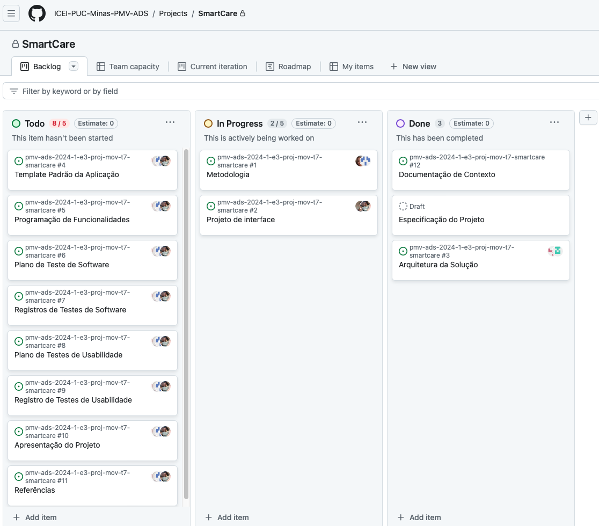

# Metodologia

Nosso grupo adotará a metodologia ágil Scrum para abordar o problema do desenvolvimento do aplicativo de lembretes de medicamentos. Optamos por essa abordagem devido à sua capacidade de adaptação a mudanças, foco na entrega de valor ao cliente e ênfase na colaboração e comunicação contínua.

Para organizar nossa equipe, usaremos a ferramenta Trello para gerenciar as tarefas e o progresso do projeto. No Trello, criaremos quadros para cada sprint do Scrum, onde listamos as tarefas a serem realizadas, em andamento e concluídas. Isso nos permitirá visualizar o fluxo de trabalho e acompanhar o progresso do projeto de forma transparente.

## Relação de Ambientes de Trabalho

Os artefatos do projeto são desenvolvidos em várias plataformas. A tabela abaixo detalha os ambientes, suas plataformas correspondentes e os links de acesso:
<table>
  <thead>
    <tr>
      <th>Ambiente</th>
      <th>Plataforma</th>
      <th>Link de Acesso</th>
    </tr>
  </thead>
  <tbody>
    <tr>
      <td>Repositório de código fonte</td>
      <td>GitHub</td>
      <td><a href="https://github.com/ICEI-PUC-Minas-PMV-ADS/pmv-ads-2024-1-e3-proj-mov-t7-smartcare.git">GitHub Repository</a></td>
    </tr>
    <tr>
      <td>Banco de Dados</td>
      <td></td>
      <td></td>
    </tr>
    <tr>
      <td>Projeto de Interface e  Wireframes</td>
      <td>Figma</td>
      <td><a href="https://www.figma.com/file/Q4y45mdJkQphxEDUcGQfPS/SmartCare?type=design&node-id=0-1&mode=design&t=uL0hZhXHfkyFkCRL-0">Figma</a></td>
    </tr>
    <tr>
      <td>Gerenciamento do Projeto</td>
      <td>Kanban Trello</td>
      <td><a href="https://github.com/orgs/ICEI-PUC-Minas-PMV-ADS/projects/912">Trello</a></td>
    </tr>
  </tbody>
</table>

## Controle de Versão

A ferramenta de controle de versão adotada no projeto foi o
[Git](https://git-scm.com/), sendo que o [Github](https://github.com)
foi utilizado para hospedagem do repositório. Adoção de uma estratégia de branching que define como o código é organizado em branches (ramos) para desenvolvimento, testes e produção. Realização de revisões de código regularmente para garantir a qualidade e a consistência do código. Ferramentas como o GitHub facilitam esse processo. 

O projeto segue a seguinte convenção para o nome de branches:

- `main`: versão estável já testada do software
- `unstable`: versão já testada do software, porém instável
- `testing`: versão em testes do software
- `dev`: versão de desenvolvimento do software

Quanto à gerência de issues, o projeto adota a seguinte convenção para
etiquetas:

- `documentation`: melhorias ou acréscimos à documentação
- `bug`: uma funcionalidade encontra-se com problemas
- `enhancement`: uma funcionalidade precisa ser melhorada
- `feature`: uma nova funcionalidade precisa ser introduzida

## Gerenciamento de Projeto

### Divisão de Papéis

Apresente a divisão de papéis entre os membros do grupo.

Exemplificação: A equipe utiliza metodologias ágeis, tendo escolhido o Scrum como base para definição do processo de desenvolvimento. A equipe está organizada da seguinte maneira:
- Scrum Master: Maria de Lourdes Monteiro;
- Product Owner: Ademir Colares Dos Santos Junior;
- Equipe de Desenvolvimento: Jefferson Freitas Da Silva, Israel Cunha Da Silva;
- Equipe de Design: Bianca Camila Pereira Reis.
- Equipe de Quality Assurance: Leonardo Júnio De Paula.

### Processo

Para organização e distribuição das tarefas do projeto, a equipe está utilizando o Trello estruturado com as seguintes listas:
 
- To Do: tarefas elencadas para a Sprint ativa;
- In Progress: tarefas em execução;
- Done: tarefas finalizadas.

O quadro a seguir foi desenvolvido pelo grupo na ferramenta de gerenciamento de projetos está disponível através da URL Kanban GitHub. e é apresentado, no estado atual, na Figura .

### Ferramentas

As ferramentas empregadas no projeto são:

- Visual Studio Code.
  O VS Code é um editor de código altamente popular e amplamente utilizado na indústria de desenvolvimento de software. Sua escolha se baseia na sua versatilidade, extensibilidade e eficiência no desenvolvimento de software. 

- Microsoft Teams e Whatsapp.
O Microsoft Teams é uma plataforma de colaboração que oferece uma variedade de recursos, incluindo chat, videoconferência, compartilhamento de arquivos e integração com outras ferramentas da Microsoft, como o Office 365. Sua escolha se baseia na capacidade de facilitar a comunicação e a colaboração entre os membros da equipe em tempo real, bem como na sua integração com outras ferramentas usadas no ambiente de trabalho.
A escolha do WhatsApp se deve à sua capacidade de oferecer comunicação rápida e informal entre os membros da equipe, especialmente em situações em que o acesso a outras plataformas de comunicação, como o Microsoft Teams, pode não ser viável. Essa ferramenta permite trocas rápidas de mensagens, compartilhamento de informações e coordenação de atividades de forma eficaz, especialmente em equipes remotas.

- Figma.
  Figma é uma ferramenta de design colaborativo baseada na web que permite criar, prototipar e compartilhar interfaces de usuário e designs de forma eficiente. Sua escolha se baseia na capacidade de facilitar a colaboração entre designers e desenvolvedores, bem como na sua capacidade de criar diagramas e protótipos que capturam de forma precisa e detalhada as necessidades e requisitos da solução em desenvolvimento. Além disso, o Figma oferece recursos avançados de colaboração em tempo real, o que é essencial para equipes distribuídas geograficamente.
