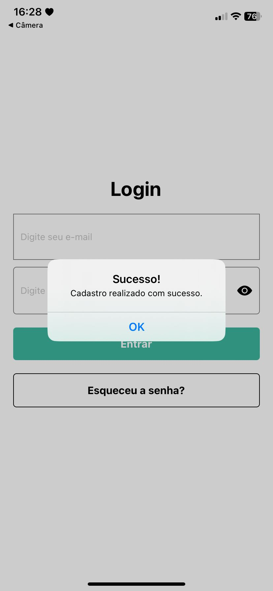
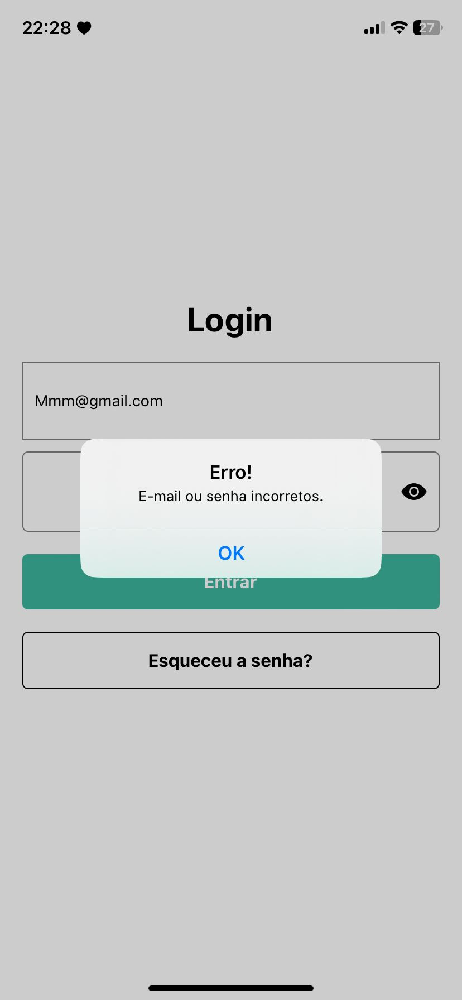
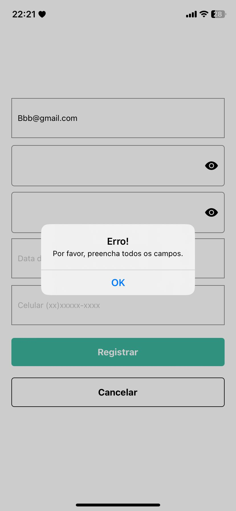

# Registro de Testes de Software

Pré-requisitos: <a href="08-Plano de Testes de Software.md"> Plano de Testes de Software</a>

  
Relatório com as evidências dos testes de software realizados no sistema pela equipe, baseado em um plano de testes pré-definido.

| CT a serem avaliados: |
| :---	|
| CT-001:Registro de nova receita  |
| CT-002:Edição de medicamento	|
| CT-003:Tentativa de Login com Senha Inválida  |
| CT-004:Registro de novo usuário  |
| CT-005:Registro de Novo Usuário - Campos Obrigatórios Ausentes  |
| CT-006:Teste de Login com Nome de Usuário Inválido   |

| **Caso de Teste**| **CT-001: Registro de nova receita** |
| :--- | :---: |
| Procedimentos (passo à passo) | 1.Logar no sistema.  2.Navegar até a seção de receitas médicas.  3.Clicar no botão "Adicionar nova receita Receita".  4.Preencher todos os campos obrigatórios.  5.Salvar a receita. |
| Resultado esperado |A receita médica é registrada com sucesso no sistema e todas as informações são salvas corretamente|
| Avaliação | O sistema validou com sucesso as informações inseridas. |
| Evidência |   |

| **Caso de Teste** | **CT-002: Edição de medicamento** |
| :--- | :---: |
| Procedimentos (passo à passo) | 1.Logar no sistema.  2.Navegar até a seção de medicamentos.  3.Selecionar um medicamento existente.  4.Clicar no botão de edição.  5.Alterar os detalhes do medicamento.  6.Salvar as alterações. |
| Resultado esperado | As informações do medicamento são atualizadas corretamente no sistema após a edição |
| Avaliação | O sistema valida com sucesso as alterações.|
| Evidência | |

| **Caso de Teste**| **CT-003:Tentativa de Login com Senha Inválida** |
| :--- | :---: |
| Procedimentos (passo à passo) | 1.Abrir o aplicativo na tela de login.  2.Inserir um nome de usuário válido no campo correspondente.  3.Inserir uma senha inválida no campo de senha.  4.Clicar no botão de login.|
| Resultado esperado |O sistema não permite o login com a senha inválida e exibe uma mensagem de erro indicando que a senha está incorreta. O usuário deve permanecer na tela de login e deve ser solicitado a tentar novamente.| 
| Avaliação | O sistema não permite que o usuario acesse as areas restritas. |
| Evidência |  |

| **Caso de Teste** | **CT-004:  Registro de novo usuário** |
| :--- | :---: |
| Procedimentos (passo à passo) | 1.Acessar a página de registro do sistema.  2.Preencher todos os campos obrigatórios.  3.Escolher um nome de usuário e senha.  4.Confirmar o registro. |
| Resultado esperado |O novo usuário é registrado com sucesso no sistema e pode efetuar login usando as credenciais fornecidas|
| Avaliação |O sistema validou com sucesso o novo usuario inserido.|
| Evidência | |

| **Caso de Teste** | **CT-005: Registro de Novo Usuário - Campos Obrigatórios Ausentes** |
| :--- | :---: |
| Procedimentos (passo à passo) | 1.Acessar a página de registro do sistema.  2.Tentar confirmar o registro sem preencher nenhum dos campos obrigatórios. 3.Verificar se o sistema exibe mensagens de erro indicando os campos obrigatórios que precisam ser preenchidos.  4.Tentar confirmar o registro preenchendo apenas alguns dos campos obrigatórios.  5.Verificar se o sistema exibe mensagens de erro indicando os campos obrigatórios que ainda estão em branco. |
| Resultado esperado |O sistema impede o registro de um novo usuário quando os campos obrigatórios estão ausentes e exibe mensagens de erro relevantes indicando os campos que precisam ser preenchidos.|
| Avaliação | O sistema não permite o registro do novo usuario sem os campos abrigatoriios prenchidos. |
| Evidência ||

| **Caso de Teste**| **CT-006:  Teste de Login com Nome de Usuário Inválido** |
| :--- | :---: |
| Procedimentos (passo à passo) | 1.Acessar a página de login do sistema.  2.Inserir um nome de usuário inválido.  3.Inserir uma senha válida.  4.Tentar fazer login.  5.Verificar se o sistema exibe uma mensagem de erro indicando que o nome de usuário é inválido.|
| Resultado esperado |O sistema impede o login com um nome de usuário inválido e exibe uma mensagem de erro relevante indicando o problema.|
| Avaliação |O sistema não permite o login como as credenciais incorretas.|
| Evidência | |

