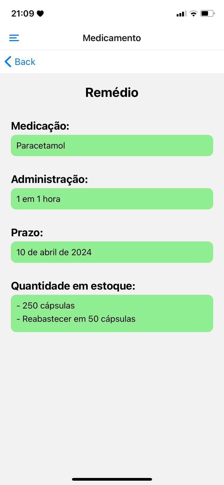
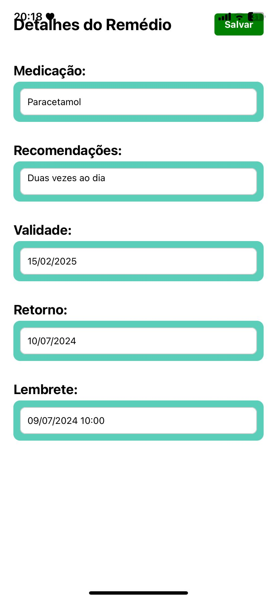
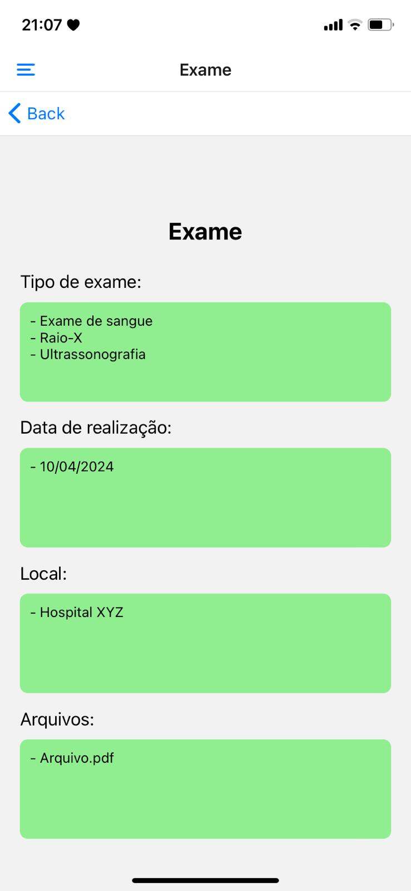
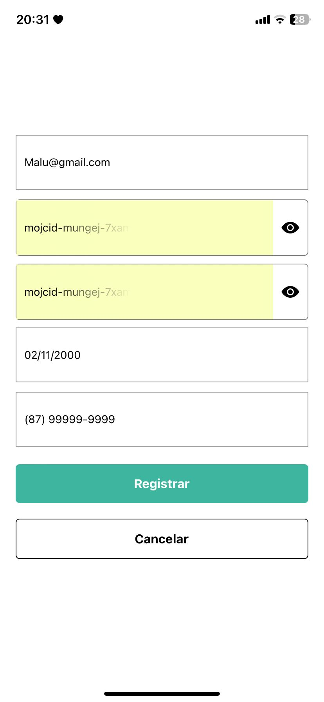
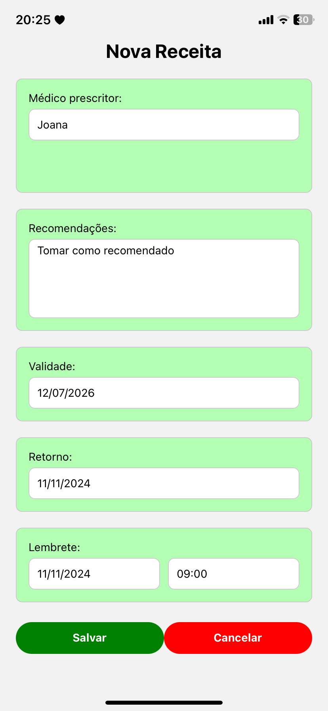
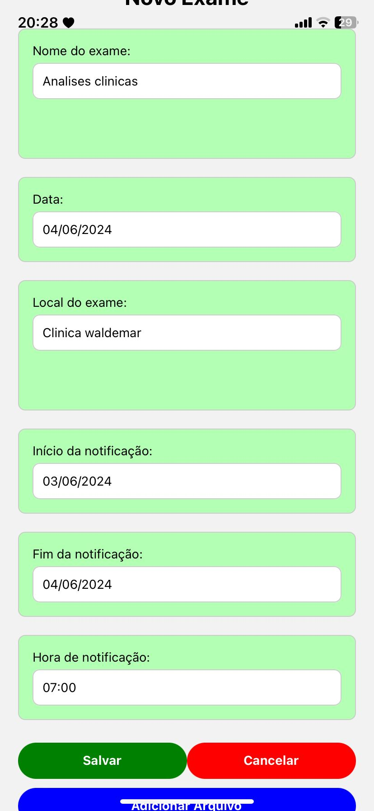

# Registro de Testes de Software

Pré-requisitos: <a href="08-Plano de Testes de Software.md"> Plano de Testes de Software</a>

  
Relatório com as evidências dos testes de software realizados no sistema pela equipe, baseado em um plano de testes pré-definido.

| CT a serem avaliados: |
| :---	|
| CT-001:Registro de nova receita  |
| CT-002:Edição de medicamento	|
| CT-003:Anexação de docomento a um exame medico  |
| CT-004:Registro de novo usuário  |
| CT-005:Edição do perfil do usuário   |
| CT-006:Confirmação da administração de dose   |
| CT-007:Emissão de lembretes de receita médica   |
| CT-008:Emissão de lembretes de administração de medicamentos   |
| CT-009:Emissão de lembretes de realização de exames  |

| **Caso de Teste**| **CT-001: Registro de nova receita** |
| :--- | :---: |
| Procedimentos (passo à passo) | 1.Logar no sistema.  2.Navegar até a seção de receitas médicas.  3.Clicar no botão "Adicionar nova receita Receita".  4.Preencher todos os campos obrigatórios.  5.Salvar a receita. |
| Resultado esperado |A receita médica é registrada com sucesso no sistema e todas as informações são salvas corretamente|
| Avaliação | O sistema validou com sucesso as informações inseridas. |
| Evidência |   |

| **Caso de Teste** | **CT-002: Edição de medicamento** |
| :--- | :---: |
| Procedimentos (passo à passo) | 1.Logar no sistema.  2.Navegar até a seção de medicamentos.  3.Selecionar um medicamento existente.  4.Clicar no botão de edição.  5.Alterar os detalhes do medicamento.  6.Salvar as alterações. |
| Resultado esperado | As informações do medicamento são atualizadas corretamente no sistema após a edição |
| Avaliação | |
| Evidência | |

| **Caso de Teste**| **CT-003:Anexação de documento a um exame médico** |
| :--- | :---: |
| Procedimentos (passo à passo) | 1.Logar no sistema.  2.Navegar até a seção de exames médicos.  3.Selecionar um exame existente.  4.Clicar no botão de anexar documento.  5.Selecionar o documento a ser anexado.  6.Confirmar o upload do documento. |
| Resultado esperado |O documento é anexado com sucesso ao exame médico selecionado e pode ser visualizado pelos usuários autorizados.| 
| Avaliação | O sistema validou com sucesso o documento inserido. |
| Evidência |  |

| **Caso de Teste** | **CT-004:  Registro de novo usuário** |
| :--- | :---: |
| Procedimentos (passo à passo) | 1.Acessar a página de registro do sistema.  2.Preencher todos os campos obrigatórios.  3.Escolher um nome de usuário e senha.  4.Confirmar o registro. |
| Resultado esperado |O novo usuário é registrado com sucesso no sistema e pode efetuar login usando as credenciais fornecidas|
| Avaliação |O sistema validou com sucesso o novo usuario inserido.|
| Evidência | |

| **Caso de Teste** | **CT-005: Edição dos perfil do usuário** |
| :--- | :---: |
| Procedimentos (passo à passo) | 1.Logar no sistema com as credenciais do usuário.  2.Navegar até a seção de perfil do usuário.  3.Clicar no botão de edição de perfil.  4.Editar as informações necessárias. Salvar as alterações. |
| Resultado esperado |As informações do perfil do usuário são atualizadas corretamente no sistema após a edição.|
| Avaliação |  |
| Evidência |  |

| **Caso de Teste**| **CT-006:  Confirmação da Administração de Dose** |
| :--- | :---: |
| Procedimentos (passo à passo) | 1.Logar no sistema com as credenciais do usuário.  2.Navegar até a seção de administração de medicamentos.  3.Selecionar um medicamento para administração.  4.Confirmar a administração da dose. |
| Resultado esperado |O sistema subtrai a quantidade administrada do medicamento do estoque e atualiza automaticamente a quantidade disponível.|
| Avaliação |O sistema não subtrai nem atualiza.|
| Evidência | |

| **Caso de Teste**| **CT-007: Emissão de Lembretes de Receita Médica** |
| :--- | :---: |
| Procedimentos (passo à passo) | 1.Logar no sistema com as credenciais do usuário.  2.Verificar se há lembretes sobre consultas de retorno, prazos e horários da consulta de retorno e validade da receita|
| Resultado esperado |O sistema emite lembretes relevantes relacionados à receita médica conforme especificado nos requisitos.|
| Avaliação |O sistema emite com sucesso o lembrete inserido.|
| Evidência | |

| **Caso de Teste**| **CT-008: Emissão de Lembretes de Administração de Medicamentos** |
| :--- | :---: |
| Procedimentos (passo à passo) |  1.Logar no sistema com as credenciais do usuário.  2.Verificar se há lembretes sobre horários e prazos para a administração de medicamentos.  3.Verificar se há alertas sobre a necessidade de reposição quando o estoque estiver baixo. |
| Resultado esperado |O sistema emite lembretes relevantes relacionados à administração de medicamentos conforme especificado nos requisitos.|
| Avaliação |O sistema emite com sucesso o lembrete inserido|
| Evidência | |

| **Caso de Teste**| **CT-009: Emissão de Lembretes de Realização de Exames** |
| :--- | :---: |
| Procedimentos (passo à passo) |  1.Logar no sistema com as credenciais do usuário. 
Verificar se há lembretes sobre datas e prazos para a realização de exames. |
| Resultado esperado |O sistema emite lembretes relevantes relacionados à realização de exames conforme especificado nos requisitos|
| Avaliação |O sistema emite com sucesso o lembrete inserido|
| Evidência |  

